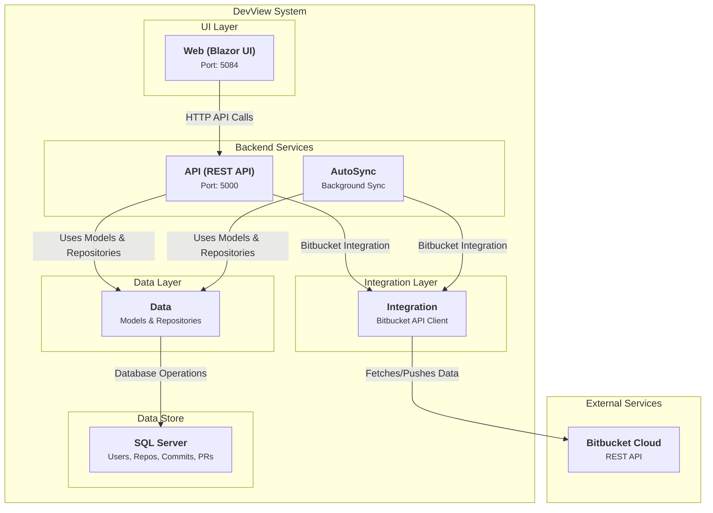

# DevView - Bitbucket Analytics Dashboard

DevView is a comprehensive .NET 9 solution for analyzing Bitbucket repositories with real-time analytics, beautiful visualizations, and GitHub-style insights.

## 🌟 Features

### 📊 Analytics Dashboard
- **Interactive Charts**: Multi-dataset area charts showing code lines added/removed over time
- **Individual Contributors**: GitHub-style contributor activity charts with detailed statistics
- **Date Range Filtering**: Flexible date range selection with quick presets (30 days, 3 months, etc.)
- **Real-time Data**: Live updates when changing repositories or date ranges
- **Responsive Design**: Modern Bootstrap-based UI that works on all devices

### 🔧 Data Management
- **Bitbucket Integration**: Automated syncing of repositories, commits, and pull requests
- **Smart Data Storage**: Optimized SQL schema with proper indexing
- **API-First Architecture**: RESTful endpoints for all operations
- **Advanced Analytics**: Code line analysis, contributor statistics, and activity patterns

### 🚀 Modern Tech Stack
- **Backend**: .NET 9 ASP.NET Core Web API
- **Frontend**: Blazor Server with Radzen UI components
- **Database**: SQL Server with optimized schema
- **Charts**: Chart.js with custom configurations
- **APIs**: Bitbucket Cloud REST API integration

## ��️ Architecture



## 🔄 Data Flow Overview

DevView follows a clean architecture pattern with clear separation of concerns:

1. **Data Layer**: Centralized data access and business models
   - Database models (Commit, CommitFile, PullRequest, SyncSettings)
   - Repository pattern implementation for CRUD operations
   - Shared between API and AutoSync for consistent data access

2. **Integration Layer**: Handles all Bitbucket API communication
   - Fetches users, repositories, commits, and pull requests
   - Parses commit diffs and classifies file types
   - Manages API rate limiting and error handling

3. **API Layer**: Provides RESTful endpoints for data access
   - Analytics endpoints for charts and insights
   - Sync endpoints for manual data updates
   - Commit and PR management endpoints

4. **Web Layer**: Blazor Server application for user interface
   - Real-time dashboard with interactive charts
   - Admin pages for data management
   - Responsive design with modern UI components

5. **AutoSync Service**: Background data synchronization
   - Full sync mode: Historical data import in batches
   - Delta sync mode: Recent changes synchronization
   - Configurable sync targets (users, repos, commits, PRs)

### Sync Modes
- **Full Sync**: Imports complete repository history in 10-day batches
- **Delta Sync**: Syncs only recent changes (configurable days)
- **Selective Sync**: Choose which data types to synchronize

### Project Structure
```
DevView.sln
├── API/                             # 🔧 ASP.NET Core Web API
│   ├── Endpoints/
│   │   ├── Analytics/               # 📊 Analytics controllers & DTOs
│   │   ├── Commits/                 # 📝 Commit data endpoints
│   │   ├── PullRequests/            # 🔀 Pull request endpoints
│   │   └── Sync/                    # 🔄 Data synchronization
│   ├── Services/                    # 🛠️ Business logic services
│   ├── SqlSchema/                   # 🗄️ Database schema files
│   └── appsettings.json            # ⚙️ API configuration
│
├── Data/                            # 📊 Shared Data Layer
│   ├── Models/                      # 📋 Database entity models
│   │   ├── Commit.cs               # 📝 Commit data model
│   │   ├── CommitFile.cs           # 📄 Commit file details
│   │   ├── PullRequest.cs          # 🔀 Pull request model
│   │   └── SyncSettings.cs         # ⚙️ Sync configuration
│   └── Services/                    # 🛠️ Data access services
│       ├── DatabaseService.cs      # 🗄️ Base database service
│       ├── CommitRepository.cs     # 📝 Commit data operations
│       └── PullRequestRepository.cs # 🔀 PR data operations
│
├── Web/                             # 🌐 Blazor Server Web App
│   ├── Components/
│   │   ├── Pages/
│   │   │   ├── Dashboard.razor      # 📊 Main analytics dashboard
│   │   │   ├── UserDashboard.razor  # 👤 User-specific analytics
│   │   │   ├── Commits.razor        # 📝 Commit analysis
│   │   │   ├── PullRequests.razor   # 🔀 PR analysis
│   │   │   ├── TopCommitters.razor  # 🏆 Top contributors
│   │   │   └── Admin/               # 🔐 Admin pages
│   │   ├── Common/                  # 🔄 Reusable components
│   │   └── Layout/                  # 🎨 UI layout components
│   ├── Services/                    # 🛠️ Web app services
│   └── appsettings.json            # ⚙️ Web app configuration
│
├── Integration/                     # 🔌 Bitbucket API Integration
│   ├── Commits/                     # 📝 Commit data fetching
│   ├── PullRequests/               # 🔀 PR data fetching
│   ├── Repositories/               # 📁 Repository management
│   ├── Users/                      # 👥 User data management
│   ├── Common/                     # 🛠️ Shared API client & config
│   └── Utils/                      # 🔧 Utility services
│
├── AutoSync/                        # ⏰ Background Sync Service
│   └── Program.cs                  # 🚀 Main sync application
│
└── start-dev.sh                    # 🚀 Development startup script
```

## 🚀 Quick Start

### Prerequisites
- [.NET 9 SDK](https://dotnet.microsoft.com/download/dotnet/9.0)
- [SQL Server](https://www.microsoft.com/en-us/sql-server/sql-server-downloads) (or SQL Server Express)
- [Git](https://git-scm.com/)

### 1. Clone & Setup
```bash
git clone https://github.com/bhardwajvicky/DevView.git
cd DevView
```

### 2. Configuration Setup
```bash
# Run the configuration setup script
./setup-config.sh
```

This will:
- Copy configuration templates to actual config files
- Provide instructions for filling in sensitive values
- Make startup scripts executable

### 3. Database Setup
1. **Create Database**: Create a new database named `bb` in SQL Server
   ```sql
   CREATE DATABASE bb;
   ```
2. **Run Schema**: Execute the complete SQL schema from `API/SqlSchema/schema.sql` to create all tables:
   - Users table (with avatar support)
   - Repositories table 
   - Commits table (with code line tracking)
   - PullRequests table
   - All necessary indexes and foreign key relationships
3. **Configure Connection**: Update the connection string in `API/appsettings.json` (created from template)

### 4. Start Development Environment
```bash
# Option 1: Use the automated script (Recommended)
./start-dev.sh

# Option 2: Manual startup
# Terminal 1 - Start API
cd API
dotnet run

# Terminal 2 - Start Web App
cd Web
dotnet run
```

### 5. Access the Application
- **📊 Dashboard**: http://localhost:5084/dashboard
- **🧪 API Test**: http://localhost:5084/api-test
- **📖 API Docs**: http://localhost:5000/swagger

## 📋 Configuration

### API/appsettings.json
```json
{
  "ConnectionStrings": {
    "DefaultConnection": "Server=localhost;Database=bb;User Id=sa;Password=YourPassword;TrustServerCertificate=True;"
  },
  "Bitbucket": {
    "ApiBaseUrl": "https://api.bitbucket.org/2.0/",
    "ConsumerKey": "your-consumer-key",
    "ConsumerSecret": "your-consumer-secret"
  }
}
```

### Web/appsettings.json
```json
{
  "Logging": {
    "LogLevel": {
      "Default": "Information",
      "Microsoft.AspNetCore": "Warning"
    }
  },
  "AllowedHosts": "*",
  "ApiBaseUrl": "http://localhost:5000"
}
```

## 📊 Data Synchronization

Before using the dashboard, you need to sync data from Bitbucket:

### 1. Sync Repositories
```bash
# Sync all repositories for a workspace
POST /api/sync/repositories/{workspace}
```

### 2. Sync Users
```bash
# Sync workspace members
POST /api/sync/users/{workspace}
```

### 3. Sync Commits
```bash
# Sync commits for a specific repository
POST /api/sync/commits/{workspace}/{repoSlug}
Content-Type: application/json

{
  "startDate": "2019-01-01T00:00:00",
  "endDate": "2019-12-31T23:59:59"
}
```

### 4. Sync Pull Requests
```bash
# Sync pull requests for a repository
POST /api/sync/pullrequests/{workspace}/{repoSlug}
Content-Type: application/json

{
  "startDate": "2019-01-01T00:00:00",
  "endDate": "2019-12-31T23:59:59"
}
```

## 🌐 Deployment

### Local Production Build
```bash
# Build API
cd API
dotnet publish -c Release -o ./publish

# Build Web App
cd Web
dotnet publish -c Release -o ./publish
```

### Docker Deployment
Create `Dockerfile` for API:
```dockerfile
FROM mcr.microsoft.com/dotnet/aspnet:9.0 AS base
WORKDIR /app
EXPOSE 5000

FROM mcr.microsoft.com/dotnet/sdk:9.0 AS build
WORKDIR /src
COPY ["API/API.csproj", "API/"]
COPY ["Integration/Integration.csproj", "Integration/"]
RUN dotnet restore "API/API.csproj"
COPY . .
WORKDIR "/src/API"
RUN dotnet build "API.csproj" -c Release -o /app/build

FROM build AS publish
RUN dotnet publish "API.csproj" -c Release -o /app/publish

FROM base AS final
WORKDIR /app
COPY --from=publish /app/publish .
ENTRYPOINT ["dotnet", "API.dll"]
```

### Cloud Deployment Options

#### Azure App Service
1. **Create App Service** for both API and Web
2. **Configure Connection Strings** in Application Settings
3. **Deploy** using Visual Studio, GitHub Actions, or Azure CLI

#### AWS/Other Clouds
1. Use appropriate .NET hosting services
2. Configure environment variables for database and Bitbucket settings
3. Ensure proper networking between API and Web components

### Environment Variables
For production deployment, use environment variables:
```bash
ConnectionStrings__DefaultConnection="your-production-db-connection"
Bitbucket__ConsumerKey="your-production-key"
Bitbucket__ConsumerSecret="your-production-secret"
```

## 🔧 Development

### Running Tests
```bash
# Run all tests
dotnet test

# Run with coverage
dotnet test --collect:"XPlat Code Coverage"
```

### Adding New Features
1. **API Endpoints**: Add to `API/Endpoints/`
2. **UI Components**: Add to `Web/Components/`
3. **Bitbucket Integration**: Extend `Integration/`

### Debugging
- **API Logs**: Use built-in logging or check `api.log`
- **Web Logs**: Check browser console and `web.log`
- **AutoSync Logs**: Console output shows sync progress and errors
- **Database**: Use SQL Server Management Studio or Azure Data Studio

## 📈 API Endpoints

### Analytics Endpoints
- `GET /api/analytics/repositories` - List all repositories
- `GET /api/analytics/commits/activity` - Commit activity data
- `GET /api/analytics/contributors` - Contributor activity data
- `GET /api/analytics/commits/punchcard` - Commit timing patterns

### Sync Endpoints
- `POST /api/sync/users/{workspace}` - Sync workspace users
- `POST /api/sync/repositories/{workspace}` - Sync repositories
- `POST /api/sync/commits/{workspace}/{repo}` - Sync commits
- `POST /api/sync/pullrequests/{workspace}/{repo}` - Sync pull requests

## 🔒 Security Notes

- **API Keys**: Store Bitbucket credentials securely
- **Database**: Use strong passwords and encrypted connections
- **CORS**: Configured for development ports (5084, 7051)
- **Authentication**: Consider adding OAuth for production use

## 🐛 Troubleshooting

### Common Issues

**"No Repositories Found"**
1. Check API connection on `/api-test` page
2. Verify database has repository data
3. Ensure sync process completed successfully

**Chart Not Loading**
1. Check browser console for JavaScript errors
2. Verify Chart.js CDN is accessible
3. Check data format in network tab

**API Connection Errors**
1. Ensure API is running on port 5000
2. Check CORS configuration
3. Verify `ApiBaseUrl` in Web settings

**Database Connection Issues**
1. Verify SQL Server is running
2. Check connection string format
3. Ensure database and schema exist

### Log Files
When using `start-dev.sh`:
- **API Logs**: `tail -f api.log`
- **Web Logs**: `tail -f web.log`

## 🤝 Contributing

1. Fork the repository
2. Create a feature branch
3. Make your changes
4. Add tests if applicable
5. Submit a pull request

## 📦 Repository Information

DevView is hosted on both GitHub and Bitbucket for redundancy and accessibility:

- **Primary Repository (GitHub)**: https://github.com/bhardwajvicky/DevView.git
- **Mirror Repository (Bitbucket)**: https://bitbucket.org/vbhardwaj66/devview.git

### Git Configuration
The repository is configured to:
- **Fetch from**: GitHub (primary source)
- **Push to**: Both GitHub and Bitbucket simultaneously

When you push changes, they will automatically be pushed to both repositories. Future development should clone from GitHub as the primary source.

## 📄 License

This project is licensed under the MIT License - see the LICENSE file for details.

---

**Made with ❤️ using .NET 9, Blazor, and Chart.js**

# Launch Settings Templates

This repository includes launch settings templates for both the API and Web projects to help standardize local development environments.

## API Project (API)
- **Template file:** `API/Properties/launchSettings.template.json`
- **Default HTTP port:** `5000`
- **How to use:**
  1. Copy `API/Properties/launchSettings.template.json` to `API/Properties/launchSettings.json`.
  2. Adjust any settings as needed for your local environment.
  3. The API will be available at `http://localhost:5000` by default.

## Web Project (Web)
- **Template file:** `Web/appsettings.template.json`
- **Default HTTP port:** `5084`
- **How to use:**
  1. Copy `Web/appsettings.template.json` to `Web/Properties/launchSettings.json`.
  2. Adjust any settings as needed for your local environment.
  3. The web app will be available at `http://localhost:5084` by default.

## AutoSync Service
- **Configuration:** Uses same database and Bitbucket settings as API
- **Run manually:** `cd AutoSync && dotnet run`
- **Sync modes:** Configure in `appsettings.json` for Full or Delta sync
- **Background service:** Can be deployed as a Windows Service or Docker container

## Notes
- These templates are not used directly by the .NET runtime. You must copy them to `launchSettings.json` in the appropriate `Properties` folder for them to take effect.
- The `ASPNETCORE_ENVIRONMENT` is set to `Development` by default in these templates, which enables developer features such as Swagger UI for the API.
- Do **not** commit your local `launchSettings.json` files to version control, as they may contain machine-specific settings. 